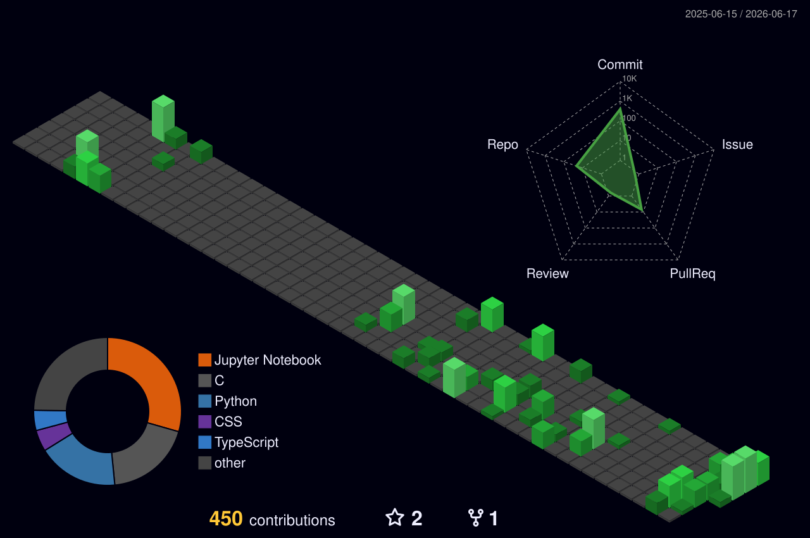

<!-- Hero Banner -->

  

<!-- 

  

  
  
  🎓 <b>B.Tech CSE (AI & ML) | Minor in Cybersecurity</b>  
  🧩 Passionate about solving real-world problems through technology  
  📚 Exploring the intersection of AI, software engineering, and research  
  💌 Open to internships, collaborations, and research opportunities  
  📍 Kolkata, India

 -->

<!-- ## 💻 Tech Stack

### 🤖 AI / Data Science

          

### 🌐 Development

      

### ☁️ Infrastructure & Tools

       -->

## 💻 Tech Stack

### 🤖 AI / Data Science

### 🌐 Development

### ☁️ Infrastructure & Tools

<!-- ====================================================== -->
<!-- FEATURED PROJECTS -->
<!-- ====================================================== -->

<h2>🚀 Featured Projects</h2>

Click a project preview to visit the live application (if available). 
Click the repository card below to view the source code.

<!-- Row 1 -->

<table>
<tr>

<td width="50%">

 

</td>

<td width="50%">

 

</td>

</tr>
</table>

<!-- Row 2 -->

<table>
<tr>

<td width="50%">

 

</td>

<td width="50%">

 

</td>

</tr>
</table>

<!-- ====================================================== -->
<!-- WORK IN PROGRESS -->
<!-- ====================================================== -->

🚧 work in progress

currently building:
- PaperYield — AI-powered research intelligence platform
- Career OS — personal career management system

public repositories will be available once development milestones are completed.

<!-- 
<h2>🛠️ Work In Progress</h2>

 -->

## 📊 Stats

  

<!--

  

-->

  

<!-- 
 -->

<!--
## 📈 Contribution Activity

  

-->

## 🔗 Let's Connect!

###

<picture>
  <source media="(prefers-color-scheme: dark)" srcset="https://raw.githubusercontent.com/logitechsoumili/logitechsoumili/output/pacman-contribution-graph-dark.svg">
  <source media="(prefers-color-scheme: light)" srcset="https://raw.githubusercontent.com/logitechsoumili/logitechsoumili/output/pacman-contribution-graph.svg">
  
</picture>
