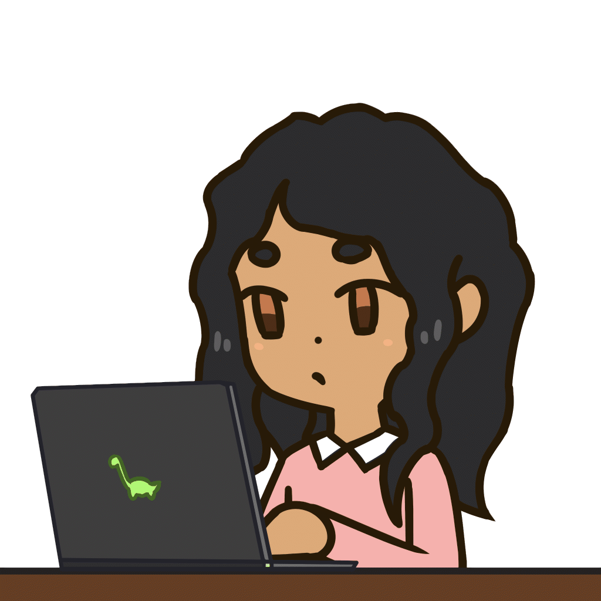
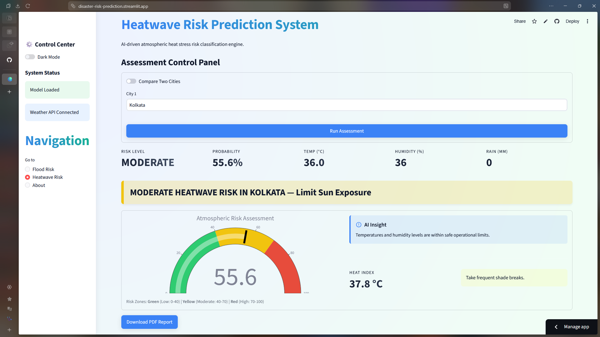
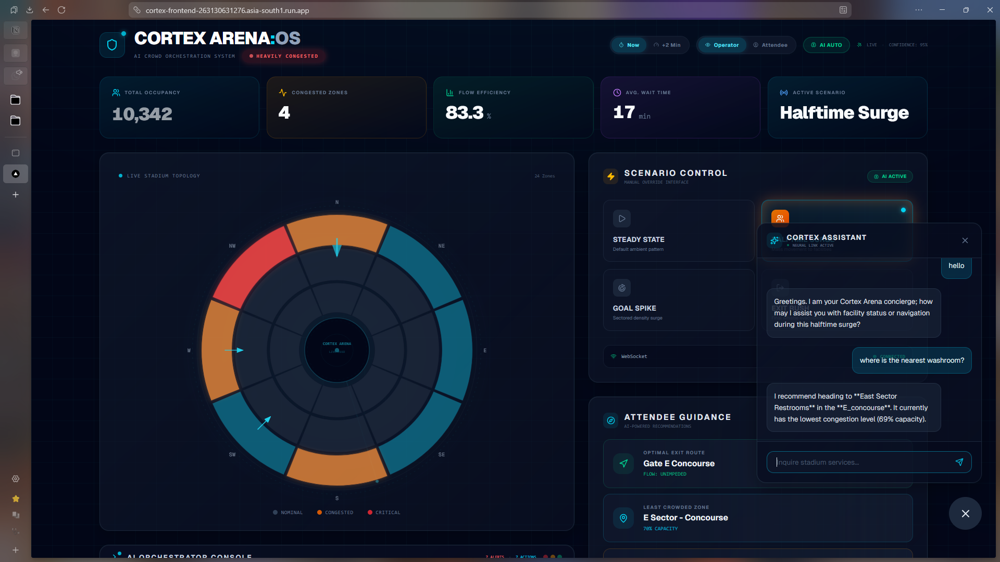

<!-- Hero Banner -->

  

  
  
  🎓 <b>B.Tech CSE (AI & ML) | Minor in Cybersecurity</b>  
  🧩 Passionate about solving real-world problems through technology  
  📚 Exploring the intersection of AI, software engineering, and research  
  💌 Open to internships, collaborations, and research opportunities  
  📍 Kolkata, India

---

<!-- ====================================================== -->
<!-- FEATURED PROJECTS -->
<!-- ====================================================== -->

<h2>🚀 Featured Projects</h2>

Click a project preview to visit the live application. 
Click the repository card below to view the source code.

<!-- Row 1 -->

<table>
<tr>

<td width="50%">

 

</td>

<td width="50%">

 

</td>

</tr>
</table>

<!-- Row 2 -->

<table>
<tr>

<td width="50%">

 

</td>

<td width="50%">

 

</td>

</tr>
</table>

<!-- ====================================================== -->
<!-- WORK IN PROGRESS -->
<!-- ====================================================== -->

<h2>🛠️ Work In Progress</h2>

Projects currently under active development.

---

### 💻 Tech Stack

 
 
 

🧭 Currently exploring: Computer Vision, Retrieval-Augmented Generation (RAG), and ML deployment.

### 📊 Stats

  

<!--

  

-->

  

<!-- 
 -->

---

### 🔗 Let's Connect!

  
  
  
