  <picture>
    <source
      media="(prefers-color-scheme: dark)"
      srcset="https://raw.githubusercontent.com/logitechsoumili/logitechsoumili/main/assets/dark.svg"
    >
    <source
      media="(prefers-color-scheme: light)"
      srcset="https://raw.githubusercontent.com/logitechsoumili/logitechsoumili/main/assets/light.svg"
    >
    
  </picture>

# Soumili Saha

Software Engineering · AI/ML · Backend Development · Research

